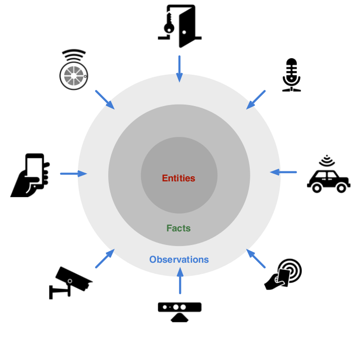
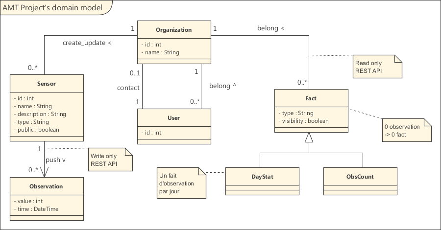

AMT Project
============

Authors : Nguyen-Phuong Le & Quang-Dung Ngo

---

# Summary

- [Introduction](#Introduction) <a id="Introduction_s"></a>
	- [Details](#Details) <a id="Details_s"></a>
- [Domain modeling](#Domain_modeling) <a id="Domain_modeling_s"></a>
- [REST API Documentation](#REST_API_Documentation) <a id="REST_API_Documentation_s"></a>
- [Use the application](#Use_the_application) <a id="Use_the_application_s"></a>
	- [Installing](#Installing) <a id="Installing_s"></a>
	- [Testing application](#Testing_application) <a id="Testing_application_s"></a>
- [Known issues](#Known_issues) <a id="Known_issues_s"></a>
- [Version](#Version) <a id="Version_s"></a>


---
# Introduction <a id="Introduction"></a>

This project has been created in the context of the AMT course of the HEIG-VD, Yverdon-les-Bains, Switzerland.

Its purpose is to create a Web API that can manage observations data coming from different sensors of all types (as in a web of things scenario, sensors coming from different devices) and deal with them to create facts that reflect some statistics out of the observations.



The scenario we have chosen to illustrate in this project is as follow : 
- Theres is different organizations, each one composed of users, that are tied with different sensors.
- Those sensors can detect different observations (composed of a value and a time of observation) that arrive at different times and that are eventually stored into a database.
- Once an observation has been detected by a sensor, different facts are created to reflect some statistics matching the totality of all observations.

You can install this platform to test how all the generated observations are handled through it and see the generated facts.

[up](#Introduction_s)

## Details <a id="Details"></a>

This project has been created for the AMT course of the HEIG-VD, under the supervision of Mr. Olivier Liechti.
It's purpose is to create an API which will manage differents sensors (which could, for example, measure the temperature of a room or detect the variations taking place in a particular area), and in turn, manage the observations captured on these sensors and turn them into facts which summarize the amount of informations given by those observations. 

The project is using JPA and a REST architecture to achieve its goals and will ultimately allow the following functionnalities:
  - Create, Read, Update and Delete organizations, sensors, users and observations
  - Display the different entries from the database in a convenient manner.
  - Allow for different users to use the API and store their informations and tie them to an organization, in order to sort them more easily

The database is composed of :
  - Organizations, defined by their id number and their names
  - Sensors, defined by their id number, name, description, type, visibility and the organization to which they are tied to.
  - Users, defined by their id number, first name, last name, email, password, the organization to which they are tied to and if they are the main contact of that organization
  - Observations, defined by their id number, name, value, creation date and the sensor to which they are tied to.
  - Facts, which come in two forms:
    - Facts tied to a particular sensor
    - Facts tied to a particular sensor, as well as a particular date

[up](#Details_s)

---
# Domain modeling <a id="Domain_modeling"></a>

Every observation can be detected by only one sensor and every sensor can detect several observations.

Each Sensor is associated with one organization and each organization can have several sensors associated with it.

Each organization is composed of several users.

Each fact can be tied to one organization and every organization can have several facts tied to it.

There is 2 types of facts. One that only counts the total number of observations per sensor and another that contains all stats per day.



[up](#Domain_modeling_s)

---

# REST API Documentation <a id="REST_API_Documentation"></a>

For more details of our API, head over to [http://quangdung.github.io/amt-project1/](http://quangdung.github.io/amt-project1/)

The folder [Documentation](https://github.com/quangdung/AMT-Project1/tree/master/Documentation) allow to modify this API documentation.

After cloning the repo, if it's the first time, in the folder `Documentation`, run `npm install`. After editing the files in the folder `Documentation/src/`, run `grunt dev` to test the API documentation locally at the address [http://localhost:7000/](http://localhost:7000/).

For more informations about the API used to generate the documentation : [apidoc-sed](https://github.com/lotaris/apidoc-seed)

[up](#REST_API_Documentation_s)

---

# Use the application <a id="Use_the_application"></a>

## Installing <a id="Installing"></a>

1. Prerequisites : 
	1. Node.js, with `node` in your `PATH`
	2. MySQL, with `mysql` in your `PATH`
	3. JavaEE with GlassFish, with `asadmin` in your `PATH`
	4. mysql-connector-java-5.1.33.jar
2. Clone this repository :

	```
	git clone git@github.com:quangdung/AMT-Project1.git

	```

3. Open the file `AMT_Project/createDbAmt1.sh`, adjust the paths:

	```
	cd '/cygdrive/c/wamp/bin/mysql/mysql5.6.12/bin'

	cd '/cygdrive/c/Program Files/glassfish-4.1/glassfish/bin'

	cp 'mysql-connector-java-5.1.33.jar' ../domains/$DOMAIN_NAME/lib

	```

	and run the script (`sh createDbAmt1.sh` in Cygwin for Windows)

4. Launch the server GlassFish and the application :

	```
	asadmin start-domain amtdatabaserest  
	
	deploy AMT_Project/AMT_Project/target/AMT_Project-1.0-SNAPSHOT
	```

[up](#Installing_s)

## Testing application <a id="Testing_application"></a>

1. After deploying, at the address [http://localhost:8080/AMT_Project/](http://localhost:8080/AMT_Project/), click on the link `Click here to get to the generating page.` to generate a couple samples of `organizations`, `sensors`, `users`.

2. Open the script `AMT_Project/node-client/client.js`, change the number of `nbSensor` and `nbObservation`. Run the script : `node client.js`. Existing `facts` and `observations` will be deleted at the beginning of the script.

[up](#Testing_application_s)

---


# Known issues <a id="Known_issues"></a>

1. We have a long time waiting when posting `observations` in parallel, due to control of concurrency. Posting 50 observations (5 sensors * 10 observations) could take 15 minutes to finish.


# Version <a id="Version"></a>
0.0.2

[up](#Version_s)
